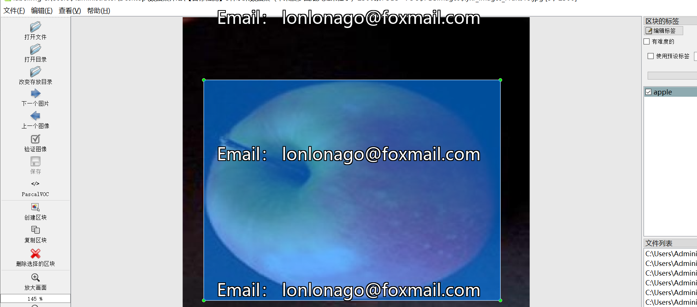
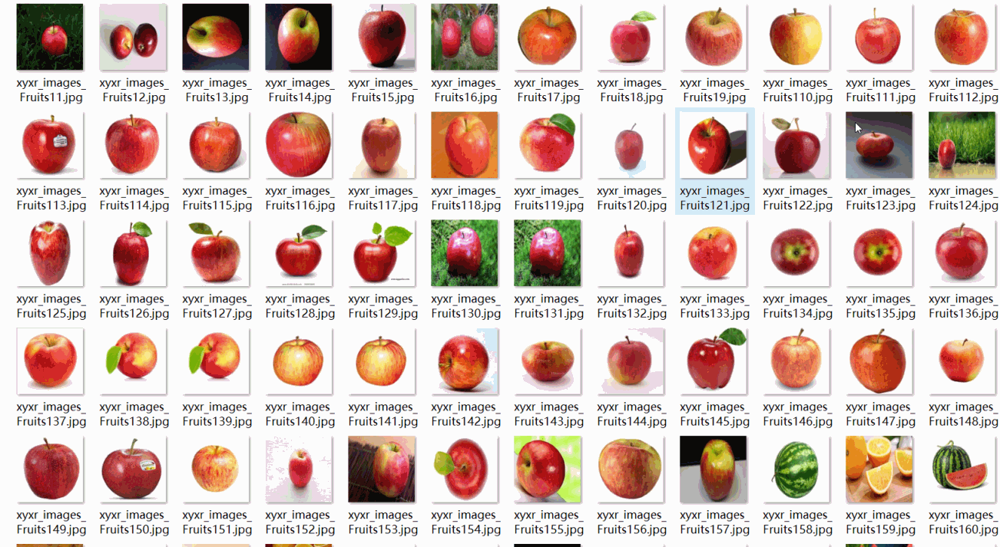
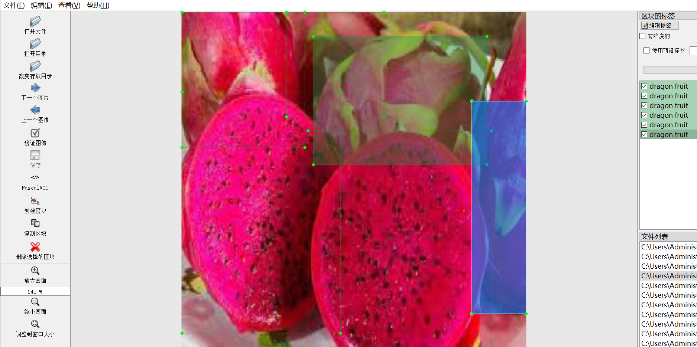
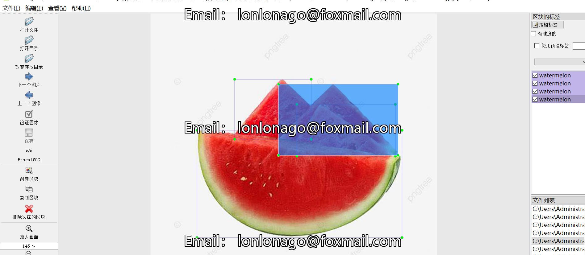

# [Object Detection] 5 Types Fruit Dataset (Apple, Pineapple, Watermelon, Fire Dragon Fruit, Orange) - 2500 Images YOLO+VOC

Dataset format: VOC format + YOLO format

The zip file contains three folders, each storing images, XML files, and txt files.

In the JPEGImages folder, there are a total of 2500 jpg images.

In the Annotations folder, there are a total of 2500 xml files.

In the labels folder, there are a total of 2500 txt files.

Number of label types: 5

Label names: ["apple", "dragon fruit", "orange", "pineapple", "watermelon"]

Each label's number of bounding boxes (note that the order in the YOLO format does not correspond to this, but is based on the classes.txt in the Labels folder):

- Apple bounding boxes = 1536
- Dragon fruit bounding boxes = 1785
- Orange bounding boxes = 1972
- Pineapple bounding boxes = 895
- Watermelon bounding boxes = 1512

Total bounding boxes: 7700

Image resolution: Clear

Image enhancement: No

Label shape: Rectangle bounding boxes for target detection recognition

Important note: There is no special statement at this time.

Special declaration: This dataset does not guarantee the accuracy or weights of the trained model or any other files. The dataset only provides accurate and reasonable annotations.

## Images

---

Here is a pay link on Stripe (https://buy.stripe.com/3cs8yP7sY87d0vu9AB). Please contact me lonlonago@foxmail.com after funding $89, and I will send you a complete data files, thank you!

